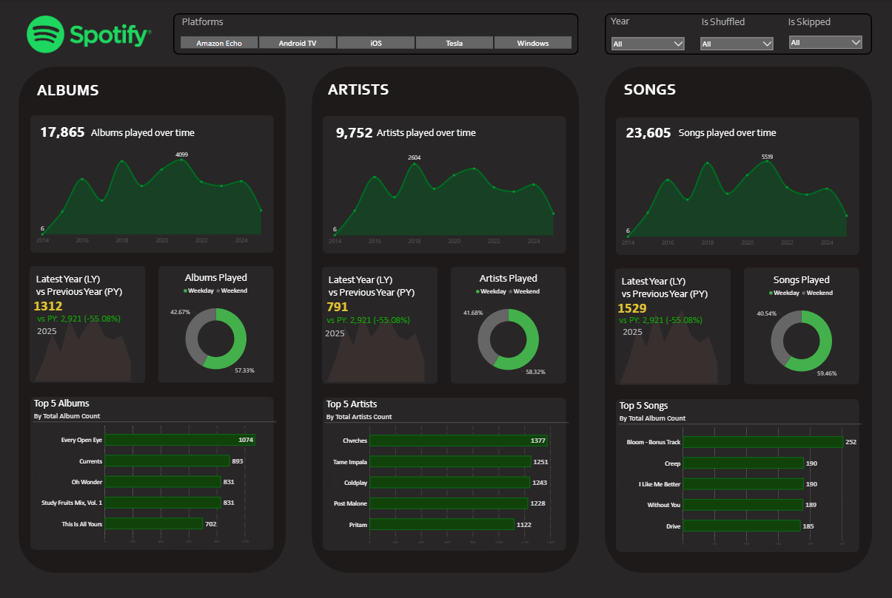
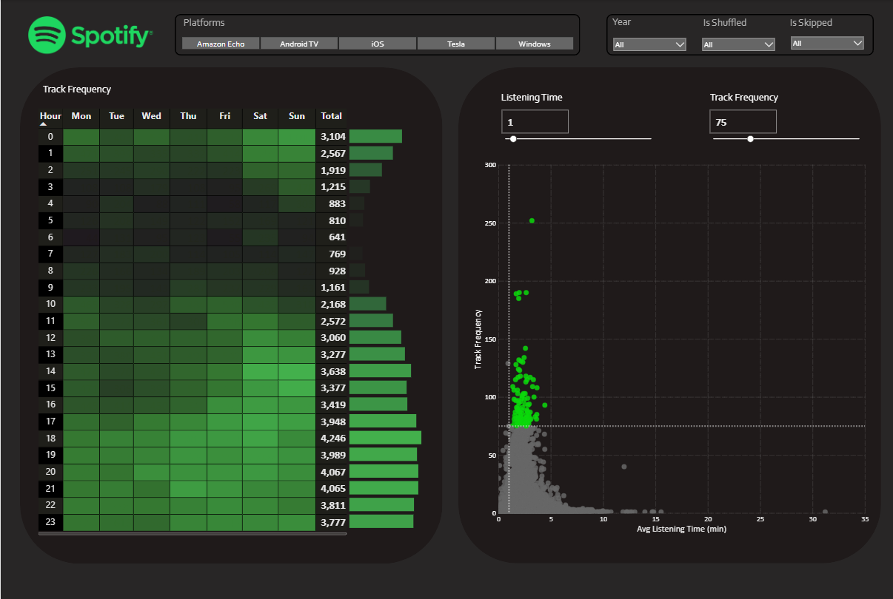

# 🎧 Spotify Listening Analytics Dashboard

This project visualizes my **Spotify listening history** using a **Power BI dashboard**, giving insights into my music habits over time.

## 📊 Dashboard Highlights

✅ Albums, Artists, and Songs over time  
✅ Year-over-year comparison of listening trends  
✅ Weekday vs. weekend listening patterns  
✅ Top albums, artists, and songs  
✅ Track frequency heatmap by hour and weekday  
✅ Listening behavior by average playtime and frequency

## 🎥 Demo Video

---

## 🔥 Screenshots

### Albums, Artists, Songs Overview

### Listening Patterns & Track Frequency

---

## ⚙️ Features

- 📈 Total plays for albums, artists, and songs since 2014  
- 📆 Year-over-year growth and decline  
- 🌅 Weekday vs. weekend listening breakdown  
- 🚀 Top 5 albums, artists, and songs ranked by plays  
- ⏰ Hourly track play heatmap  
- 📉 Scatter plot showing average listening time vs. track frequency

---

## 💡 Tools Used

- **Spotify API** (or Spotify data exports)  
- **Power BI Desktop**  
- **DAX / Power Query**  
- **Custom visualizations**  

---

## 📦 Setup

1. Export your Spotify data (`.json` or `.csv`)  
2. Load it into Power BI using Power Query  
3. Apply the provided dashboard layout & DAX formulas  
4. Customize visuals as needed

---

## 📥 How to Use

- Clone this repository  
- Add your own Spotify data  
- Open the `.pbix` file in Power BI Desktop  
- Refresh data and explore your personal insights!

---

## 📬 Contact

If you’re interested in building something similar or want the template:
- Reach out via [GitHub Issues](https://github.com/yourusername/spotify-analytics/issues)
- Or connect with me on [LinkedIn](https://www.linkedin.com/in/yourlinkedin)

---

## 📄 License

MIT License
